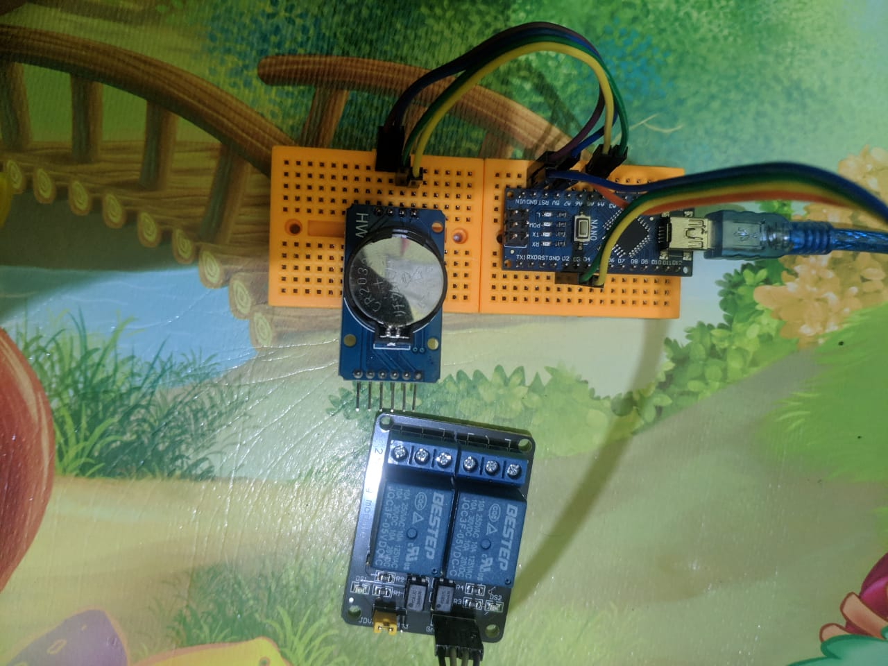
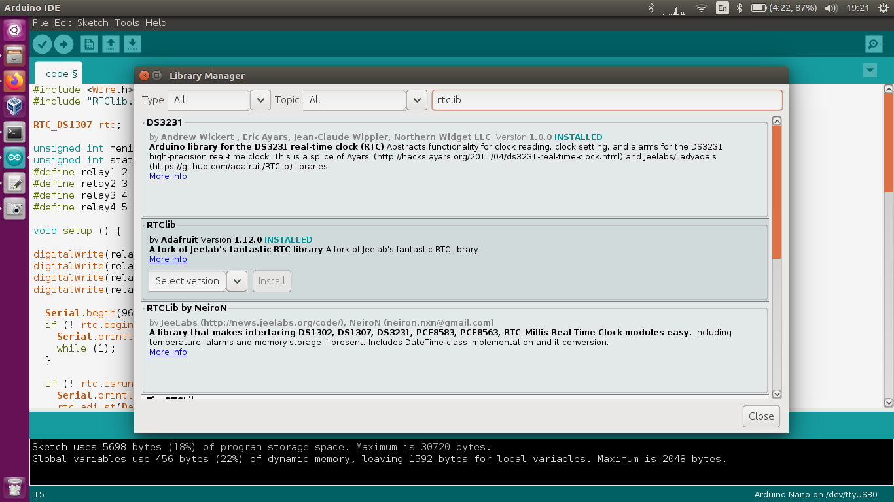
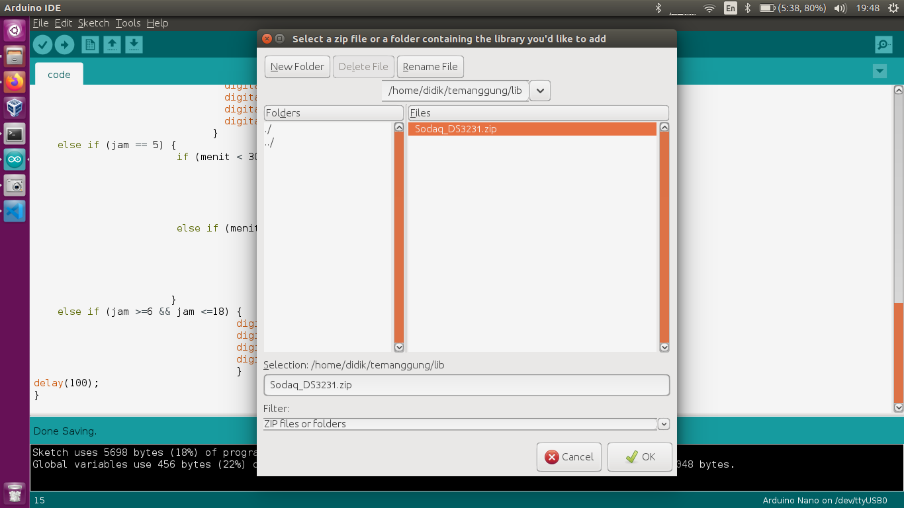

# temanggungPV
Alat otomatisasi panel surya projek Astra Green Energy di Temanggung

Configuration :

1. **Connect Pins** \
            SDA to A4\
            SCL to A\
            VCC to 5V\
            GND to GND\
            Relay 1 to D2\
            Relay 2 to D3\
            Relay 3 to D4\
            Relay 4 to D5

 	

2. **Instal the RTClib**

3. **Install Sodaq_DS3231 Lib, download file di folder lib**

4. Upload program konfigurasi.ino yang ada di folder kalibrasi untuk kalibrasi waktu di RTC
   
5. Upload program code. Done
